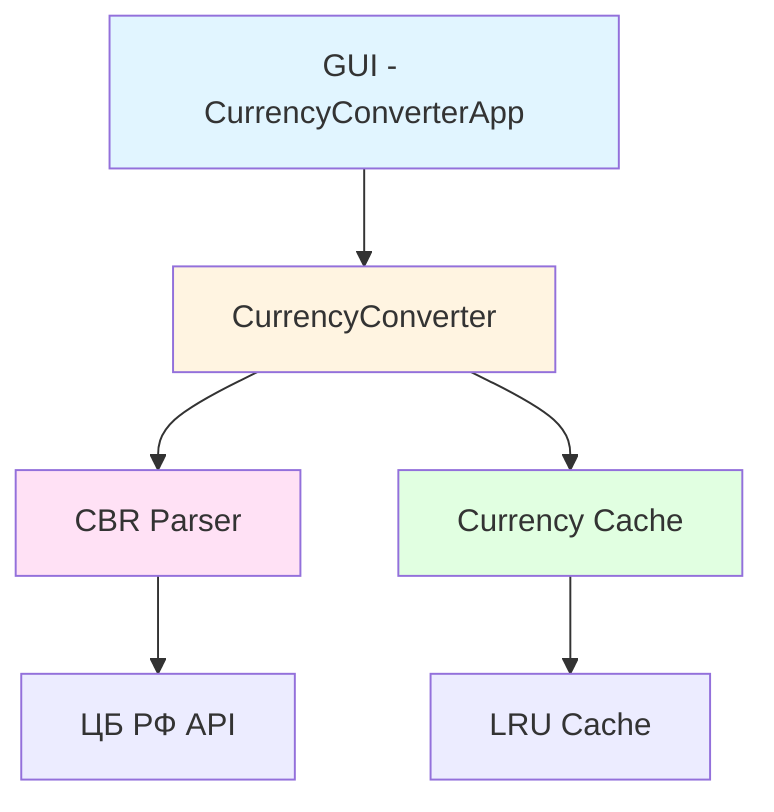

# 💱 CurRate

<div align="center">

**Конвертер валют с курсами ЦБ РФ**

[](https://www.python.org/)
[](https://github.com/bivlked/CurRate/releases/tag/v2.0.0)
[](https://python-poetry.org/)
[](LICENSE)
[](tests/)
[](tests/)
[](src/currate/)

GUI приложение на Python для конвертации USD и EUR в рубли по официальным курсам Центрального Банка РФ на заданный день

[🚀 Быстрый старт](#-быстрый-старт) • [📖 Документация](#-документация) • [🧪 Тестирование](#-тестирование) • [🤝 Вклад](#-вклад)

</div>

---

## ✨ Возможности

- 📅 **Выбор даты через календарь** - удобный интерфейс для выбора даты курса
- 💱 **Конвертация валют** - поддержка USD и EUR в рубли
- 🔄 **Актуальные курсы** - автоматическое получение курсов с официального сайта ЦБ РФ
- 💾 **Кэширование** - LRU кэш для оптимизации производительности
- 📋 **Копирование результата** - удобное копирование в буфер обмена
- 🎨 **Современный GUI** - интуитивный интерфейс на Tkinter
- 🛡️ **Обработка ошибок** - понятные сообщения об ошибках для пользователя
- 🔁 **Retry-логика** - автоматические повторы при сетевых ошибках

## 🚀 Быстрый старт

### Предварительные требования

- Python 3.14 или выше
- [Poetry](https://python-poetry.org/docs/#installation) для управления зависимостями

### Установка

```bash
# 1. Клонировать репозиторий
git clone https://github.com/bivlked/CurRate.git
cd CurRate

# 2. Установить зависимости через Poetry
poetry install

# 3. Активировать виртуальное окружение
poetry shell
```

### Запуск

```bash
# Способ 1: Через скрипт run.py (самый простой)
poetry run python run.py

# Способ 2: Запуск как модуль Python (рекомендуется)
poetry run python -m src.currate.main

# Способ 3: Прямой запуск через Poetry
poetry run python src/currate/main.py

# Способ 4: После активации виртуального окружения
poetry shell
python run.py
# или
python -m src.currate.main
# или
python src/currate/main.py
```

Приложение откроет GUI окно с:
1. 📅 Календарем для выбора даты
2. 💱 Выбором валюты (USD/EUR)
3. 💰 Полем ввода суммы
4. 🔄 Кнопкой конвертации
5. 📋 Результатом и кнопкой копирования

## 📖 Документация

### Архитектура проекта



### Структура проекта

```
CurRate/
├── src/
│   └── currate/                    # Основной код проекта
│       ├── __init__.py
│       ├── main.py                 # Точка входа приложения
│       ├── cbr_parser.py           # Парсинг курсов ЦБ РФ
│       ├── currency_converter.py   # Конвертация валют
│       ├── cache.py                # LRU кэширование курсов
│       └── gui.py                   # Графический интерфейс
├── tests/                          # Тесты (85 тестов)
│   ├── __init__.py
│   ├── test_cache.py               # Тесты кэша
│   ├── test_cache_extended.py      # Расширенные тесты кэша
│   ├── test_cbr_parser.py          # Тесты парсера ЦБ РФ
│   ├── test_cbr_parser_edge_cases.py
│   ├── test_currency_converter.py
│   ├── test_currency_converter_extended.py
│   ├── test_currency_converter_edge_cases.py
│   ├── test_format_result_critical.py
│   ├── test_error_messages.py
│   ├── test_gui_basic.py
│   └── test_main.py
├── .github/
│   └── workflows/                   # CI/CD конфигурация
├── pyproject.toml                  # Конфигурация Poetry
├── poetry.lock                     # Блокировка версий
├── pytest.ini                      # Конфигурация pytest
├── README.md                       # Этот файл
└── .gitignore
```

### Основные компоненты

#### 🔍 CBR Parser (`cbr_parser.py`)
- Получение курсов валют с официального сайта ЦБ РФ
- Retry-логика для обработки сетевых ошибок
- Понятные сообщения об ошибках для пользователя

#### 💱 Currency Converter (`currency_converter.py`)
- Конвертация USD и EUR в рубли
- Валидация входных данных
- Форматирование результата в читаемый вид

#### 💾 Cache (`cache.py`)
- LRU (Least Recently Used) кэш для оптимизации
- TTL (Time To Live) для автоматической очистки
- Автоматическое вытеснение старых записей

#### 🎨 GUI (`gui.py`)
- Современный интерфейс на Tkinter
- Календарь для выбора даты
- Копирование результата в буфер обмена

## 🧪 Тестирование

Проект имеет высокое покрытие тестами (**77%**, выше требуемых 70%):

- ✅ **91 тест** покрывают все основные компоненты
- ✅ Unit-тесты для всех модулей
- ✅ Интеграционные тесты
- ✅ Тесты граничных случаев и обработки ошибок

### Покрытие по модулям

| Модуль | Покрытие |
|--------|----------|
| `cache.py` | 95% |
| `cbr_parser.py` | 100% |
| `currency_converter.py` | 94% |
| `main.py` | 88% |
| `gui.py` | 23% |

### Запуск тестов

```bash
# Все тесты
poetry run pytest

# С подробным выводом
poetry run pytest -v

# С покрытием кода
poetry run pytest --cov=src/currate --cov-report=term-missing

# С HTML отчетом
poetry run pytest --cov=src/currate --cov-report=html

# Конкретный файл тестов
poetry run pytest tests/test_currency_converter.py
```

## 🛠️ Разработка

### Настройка окружения

```bash
# Установить все зависимости (включая dev)
poetry install

# Активировать виртуальное окружение
poetry shell
```

### Рабочий процесс

```bash
# Добавить зависимость
poetry add <package>

# Добавить dev зависимость
poetry add --group dev <package>

# Обновить зависимости
poetry update

# Форматирование кода
poetry run black src tests

# Статический анализ кода
poetry run pylint src/currate
poetry run mypy src/currate

# Запуск тестов перед коммитом
poetry run pytest
```

### Качество кода

- ✅ **Pylint**: 9.35/10
- ✅ **Mypy**: без ошибок типов
- ✅ **Black**: автоматическое форматирование
- ✅ **Pytest**: 91 тест с покрытием 77%

## 📦 Зависимости

### Основные зависимости

- **requests** (>=2.32.5) - HTTP клиент для запросов к ЦБ РФ
- **xml.etree.ElementTree** - Парсинг XML данных (встроенная библиотека Python)
- **tkcalendar** (>=1.6.1) - Календарь для Tkinter
- **pyperclip** (>=1.11.0) - Работа с буфером обмена

### Dev зависимости

- **pytest** (>=9.0.1) - Фреймворк для тестирования
- **pytest-cov** (>=7.0.0) - Покрытие кода тестами
- **pylint** (>=4.0.4) - Статический анализ кода
- **mypy** (>=1.19.0) - Проверка типов
- **types-requests** - Типы для mypy

## 🤝 Вклад

Мы приветствуем вклад в проект! Пожалуйста, ознакомьтесь с [CONTRIBUTING.md](CONTRIBUTING.md) для получения подробной информации.

### Процесс разработки

1. Fork репозитория
2. Создайте ветку для новой функции (`git checkout -b feature/amazing-feature`)
3. Внесите изменения и добавьте тесты
4. Убедитесь, что все тесты проходят (`poetry run pytest`)
5. Закоммитьте изменения (`git commit -m 'feat: Add amazing feature'`)
6. Запушьте в ветку (`git push origin feature/amazing-feature`)
7. Откройте Pull Request

## 📝 Лицензия

Этот проект распространяется под лицензией MIT. См. файл [LICENSE](LICENSE) для получения дополнительной информации.

## 👤 Автор

**Ivan Bondarev**

- GitHub: [@bivlked](https://github.com/bivlked)
- Email: ivan@bondarev.net

## 🙏 Благодарности

- Центральный Банк РФ за предоставление API курсов валют
- Разработчикам библиотек, используемых в проекте

---

<div align="center">

**Сделано с ❤️ для удобной конвертации валют**

⭐ Если проект был полезен, поставьте звезду!

</div>
